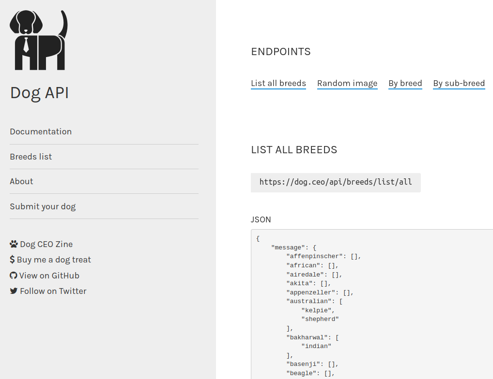
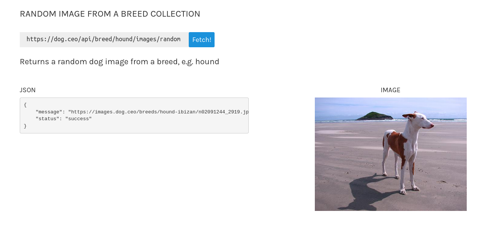

### Effortless Concurrency with Arrow-Fx on Android

#### Stojan Anastasov

@s_anastasov

<br/>

 <!-- .element width="42%" -->

----

## Agenda

- Introduce an example
- Naive solution
- Optimized solution
- Arrow-Fx functions
- Resilience (with Schedule)

----

## What is Arrow

A set of libraries, inspired by other functional programming communities, in a kotlin friendly way.

- core - typed error handling
- arrow-fx - working with coroutines
- arrow-resilience - resilience patterns
- arrow-optics - working with deep immutable types

---

### Dog CEO App

 <!-- .class="r-stretch" -->

Display a list of dog breeds with a random image for each breed.

---

## Dog CEO - All Breeds

_<!-- .class="r-stretch" -->

---

## Dog CEO - Random Image

_<!-- .class="r-stretch" -->

----

## Kotlin API

```
// List of breed names
suspend fun DogCeoApi.breedNames(): List<String> = TODO()

// Pair of breed name and random image URL
suspend fun DogCeoApi.imageUrl(
    name: String
): Pair<String, HttpUrl> = TODO()
```

---

## Naive solution

```kotlin
suspend fun DogCeoApi.naiveApproach(
): List<Pair<String, HttpUrl>> =
    breedNames().map { imageUrl(it) }
```

- Get the list of breed names
- For each element in the list, get the image

---

## Problem

It's extremely slow because it's sequential

- Duration: 20.929836273s
- Duration: 19.802737721s
- Duration: 20.897368337s

---

## Optimizing

- Open a `coroutineScope`
- use `async` to start child coroutines
- use `awaitAll()`

---

## Optimized solution (1)

```kotlin
suspend fun DogCeoApi.parallelOne(
): List<Pair<String, HttpUrl>> =
    breedNames().map {
        coroutineScope {
            async { imageUrl(it) }
        }
    }.awaitAll()

```

---

## Optimized solution (2)

```kotlin
suspend fun DogCeoApi.parallelTwo(
): List<Pair<String, HttpUrl>> =
    coroutineScope {
        breedNames()
            .map { async { imageUrl(it) } }
            .awaitAll()
    }

```

---

## Characteristics

- Executes the functions concurrently
- Functions can run in parallel depending on the dispatcher
- An error in one child cancels rest conserving resources

---

## Arrow FX

```kotlin
suspend fun DogCeoApi.arrowFx(
): List<Pair<String, HttpUrl>> =
    breedNames().parMap { imageUrl(it) }
```

- Works the same as the previous example
- Internally built the same way
- Single function change to go from sequential to concurrent
- Less error prone

---

## Ignoring errors

- Remove failed image requests from the list

---

## Ignoring errors

```kotlin
suspend fun DogCeoApi.parallelThree(): List<Pair<String, HttpUrl>> =
    coroutineScope {
        breedNames()
            .map {
                async {
                    try {
                        imageUrl(it)
                    } catch (e: IOException) {
                        null
                    }
                }
            }
            .awaitAll()
            .filterNotNull()
    }
```

---

## Ignoring errors

```kotlin
suspend fun DogCeoApi.arrowFxTwo(
): List<Pair<String, HttpUrl>> =
    breedNames().parMapNotNull {
        try {
            imageUrl(it)
        } catch (e: IOException) {
            null
        }
    }
```

---

## Limiting concurrency

```kotlin
suspend fun DogCeoApi.parallelFour(
): List<Pair<String, HttpUrl>> {
    val semaphore = Semaphore(10)
    return coroutineScope {
        breedNames()
            .map { async { semaphore.withPermit { imageUrl(it) } } }
            .awaitAll()
    }
}
```

---

## Limiting concurrency

```
suspend fun DogCeoApi.arrowFxThree(
): List<Pair<String, HttpUrl>> =
    breedNames().parMap(concurrency = 12) { imageUrl(it) }
```

Uses a semaphore internally

----

## Independent computations - motivation

- Get a random image for a breed
- Get a fun fact about a breed

```kotlin

```
// Pair of breed name and random image URL
suspend fun DogCeoApi.imageUrl(
    name: String
): Pair<String, HttpUrl> = TODO()

suspend fun DogCeoApi.funFact(): String = TODO()
---

## Independent computations

```kotlin
suspend fun DogCeoApi.execute(breedName: String): Pair<HttpUrl, String> =
    coroutineScope {
        val imageUrlD = async { imageUrl(breedName) }
        val funFactD = async { funFact(breedName) }
        imageUrlD.await() to funFactD.await()
    }
```

---

## Independent computations

```kotlin
suspend fun execute(breedName: String): Pair<HttpUrl, String> =
    parZip(
        { imageUrl(breedName) },
        { breedFunFact(breedName) }
    ) { imageUrl, funFact -> imageUrl to funFact }
```

---

## Characteristics

- Executes the functions concurrently
- Executes the lambda if all succeed
- Failure in one action cancels the other actions

---

## Racing - motivations

- Introduce local caching
- Get data from cache, if empty fetch from remote
- On successful fetch, save in cache

---

## Racing - simple

```kotlin
suspend fun breedNames(): List<String> {
    var breeds = cachedBreeds()
    if (breeds == null) {
        breeds = remoteBreeds()
    }
    return breeds
}
```

- Always paying the price (duration) of `cachedBreeds()`
- Doing it in concurrently leads to waste

---

## Racing

```kotlin
suspend fun execute(): List<String> =
    raceN(
        { cachedBreeds() }, // does NOT complete on empty cache
        { remoteBreeds() }
    ).merge()
```

- Executes the actions concurrently
- Cancels the looser, conserving resources

---

## Other functions

- parMapOrAccumulate - similar to `parMap` but accumulates all errors
- Flow.parMap - `parMap` for `Flow`, conserving order
- Flow.parMapUnordered - `parMap` for `Flow` without order


----

## Schedule

The `Schedule` type allows you to define and compose powerful yet simple policies. You can use those policies to retry or repeat computations. 

---

## Built-in policies

- `Schedule.recurs(10)` - a policy that runs up to 10 times
- `Schedule.spaced<A>(60.seconds)` - a policy that runs forever with 60 seconds break
- `Schedule.exponential<A>(10.milliseconds)` - Exponential backing off schedule
- `Schedule.fibonacci`
- `Schedule.linear`
- ... and more

---

## Schedule combinators

- `and` - runs when both want to
- `doWhile` - runs while the condition is met
- `andThen` - sequences policies
- `jittered` - adds a random delay

---

## and

```kotlin
Schedule.spaced<A>(60.seconds) and Schedule.recurs(10)
```

Runs with 60 seconds delay for up to 10 times.

---

## doWhile

```kotlin
Schedule.exponential<A>(10.milliseconds)
    .doWhile { _, duration -> duration < 60.seconds }
```

Exponential backoff with a 10 ms base until the duration is less than 60s.

---

## andThen

```kotlin
Schedule.exponential<A>(10.milliseconds)
    .doWhile { _, duration -> duration < 60.seconds }
    .andThen(
        Schedule.spaced<A>(60.seconds) and Schedule.recurs(10)
    )
    .jittered()
```

- It recurs with exponential backoff as long as the delay is less than 60 seconds
- Afterwards, we have a spaced (constant) delay of 60 seconds for up to 10 attempts
- Some random noise is added by calling `jittered`

---

## Retrying actions

```kotlin
val schedule = Schedule.spaced<Throwable>(60.seconds) and Schedule.recurs(100)

schedule.retry {
    breedImages(breedName)
}
```

---

## Repeating actions

```kotlin
val schedule = Schedule.spaced<Throwable>(60.seconds) and Schedule.recurs(100)

schedule.repeat {
    breedImages(breedName)
}
```

----

## Putting it all together

```kotlin
suspend fun DogCeoApi.arrowFxFour(): List<Pair<String, HttpUrl>> =
    breedNames().parMapNotNull {
        try {
            schedule.retry { imageUrl(it) }
        } catch (e: IOException) {
            null
        }
    }
```

---

## Conclusion

- working with lists
- independent computations
- racing
- resilience with Schedule

---

## The End

Thank you for your attention

@s_anastasov

 <!-- .element width="20%" -->